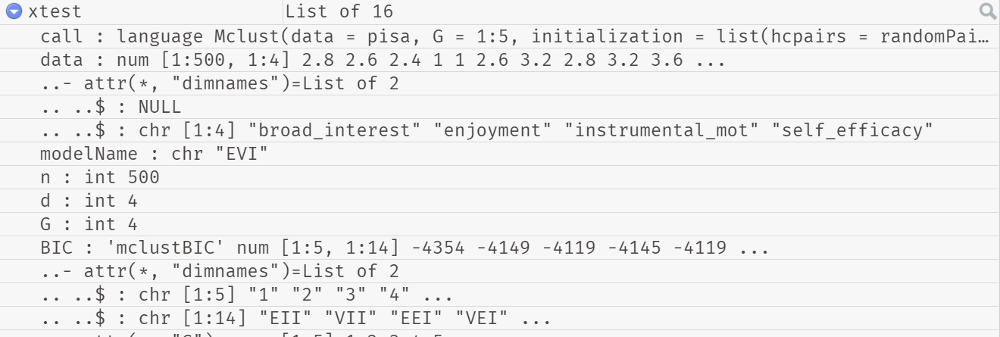

```{r setup, include=FALSE}
knitr::opts_chunk$set(echo = TRUE)
options(scipen = 6, digits = 4, width=80)
set.seed(1014)
require(readr) #to load data into R
require(tidyverse) # essential tools for wrangling and visualizing data 
require(mclust) # package for model-based clustering
```

## Objective

Write (several) functions that simplify the process of evaluating a model that was fit using mclust:  

1. **Relative fit statistics**

* Sample Size Adjusted BIC $(SABIC)$
* Consistent Akaike's Information Criterion $(CAIC)$
* Approximate Weight of Evidence Criterion $(AWE)$

2. **Classification Diagnostics**
* Relative Entropy $(E_K)$
* Average Posterior Probability of estimated classes $(AvePP_k)$
* Odds of corect classification $(OCC_k)$
* Modal class assignment proportion $(mcaP_k)$
  * **NOTE: we'll hold off on these and focus on Relative fit statistics for now**

All of these measures can be calculated based on the data stored in an mclust object. I'll walk you through examples of how to do this. 

## What's in an mclust object
Let's run mclust with the PISA data I've already shared with you. 
```{r mclustPISA, message=F} 
library(readr)
# read in all PISA data
pisa <- read_csv("data/pisa500n.csv")
head(pisa)
# Run a model (xtest)
xtest <- Mclust (pisa, # data
                 G=1:5,# of possible clusters/classes
                 initialization=list(hcpairs=randomPairs(pisa))#random start 
                 )
```

We now have an mclust object called `xtest` in the R environment. We open the documentation for the command `Mclust` inside Rstudio by running `?Mclust`. We can also view the list of Values in the object in the Global environment in Rstudio. 



You'll notice that in this view of the object xtest, there are values that are marked by `$`. We can pull those values out of the object, so that we can use them in other commands. For example, if I want to see the log-likelihood of the "best" model selected by mclust when we ran `xtest` I can use the command `xtest$loglik` and the value will print in the console. In this case the value is -1857. Similarly, the command `xtest$BIC` will print a table of the BIC values for all of the models estimated when we ran `xtest`

In some cases the values are nested. For example, there are numerous values nested under `parameters`. So, to see the mean values of the four indicators for the classes, we have to use the command `xtest$parameters$mean`. 

## Relative Fit Statistics

Relative fit statistics provide a way to compare different models and choose which model is the "best". The greater the value of the relative fit statistics, the "better" the model fit. `mclust` automatically calculates the Bayesian Information Criteria $(BIC)$ and the model with the largest $BIC$ is chosen as the "best" model. All of the relative fit statistics are similar in that they use the log-likelihood $(LL)$ of a model plus a "penalty term". It's useful to look at a variety of these statistics as the different penalties provide us with various ways to assess the model fit. The formula for $BIC$ used in `mclust` is: $2LL + d*log(n)$, 

where $LL$ is the log-likelihood of the model, $df$ is the number of parameters estimated in the model, and $n$ is the sample size of the data. The key feature of "penalty term" is the inclusion of $df$: models with a greater value of $df$ are those with greater complexity, and as a result a lower value of $BIC$ and thus a poorer "model fit."

**Note:** the formula for $BIC$ used in `mclust` is annoyingly different from the "standard" forumla used by everyone else, which transforms $LL$ by multiplying it by -2: $BIC=-2LL+d*log(n)$

Below are the forumlas for the other fit statistics I'd like to be able calculate quickly and easily. In all of these equations $log$ is the natural logarithm. I use $log$ in these equations because in R, `log` is the natural logarithm (unlike on most scientific calculators where $log$ is typically the base 10 logarithm). 

### Sample Size Adjusted BIC $(SABIC)$
$\large{-2LL + df*log(\frac{n+2}{24})}$

### Consistent Akaike's Information Criterion $(CAIC)$
$\large{-2LL + df*(log(n)+1)}$

### Approximate Weight of Evidence Criterion $(AWE)$
$\large{-2LL + 2df*(log(n)+1.5)}$

## Getting log-likelihood for models in xtest

Getting these additional fit statistics for the "best model" is relatively simple: all we need is to extract the value of the log-likelihood (`xtest$loglik`), the number of parameters (`xtest$df`) and the sample size of the data (`xtest$n`). But these statistics are used to compare multiple models, and so they aren't much use unless we have them for ALL of the potential models estimated when we ran `Mclust` and got the resulting object `xtest`. 

However, we don't have easy access to all of the information we need to do that in the `xtest` object. We know the value of n because that doesn't change. We also know the BIC values and we can view these quite easily and store the values in a table. To get rid of the annoying negative term in mclust's BIC formula, we can multiply `xtest$BIC` by -1. This will make all of the calculations to follow work the way they are supposed to. 

``` {r bictable, include=T}
negBIC <- as.data.frame(xtest$BIC[,]) 
# Now reverse the sign to get rid of the annoying negative term
bictbl<- -1*negBIC
bictbl
```

The missing piece of information is $df$ (the number of parameters in these models). We can get this information for any model using `nMclustParams`. To find the $df$ for the model EII when there are 4 indicator variables (like in the pisa data) and three components(G=3): 

```{r nmclustparams}
EEI3df<- nMclustParams("EII", d=4, G=3)
EEI3df
```

With this information, we can now get do some simple algebra and calculate the log-likelihood for the model "EII" when G=3. 

If $BIC= -2LL + df*(log(n))$ then $\large{LL = \frac{BIC-(df*log(n))}{-2}}$
We can check this by using the values of the "best model" in xtest.
```{r algebraLL}
# get the value of xtest$bic
xtest$bic
# get a positive value of the "best" bic
bicbest <- -1*(xtest$bic)
bicbest
# get the value of xtest$loglik
xtest$loglik
# use bicbest to get log-likelihood
LLbest <- (bicbest-(xtest$df*log(xtest$n)))/-2
LLbest
```

So using that same logic, I can find the log-likelihood for the model "EII" when G=3. According to the table bictbl created above that model's BIC = 4119; I could also get this value by pulling it from bictbcl based on the coordinates of the table: 

```{r pull BIC value}
bictbl
# Model EII when G=3 is in row 3 column 1 so I can extract that value by doing this
EII3bic <- bictbl[3,1]
EII3bic
```

I also now know that $df$ is 15 (from running nMclustParams above). I stored that value as `EEI3df`. I also know that $n$ will be the same as in `xtest$n`. So to get the log-likelihood: 

```{r LL of EII3}
LLEII3 <- (EII3bic-(EEI3df*log(xtest$n)))/-2
LLEII3
```

Now that I have the LL, I can easily calculate any of the other fit statistics. For example, I can get the AWE for this model: 

``` {r get awe LLEII}
LLEEI3awe <- (-2*(LLEII3))+((2*15)*(log(xtest$n)+1.5))
LLEEI3awe
```

### Getting $df$ for all of the models in xtest

To view all of the model names used by mclust: 
```{r all models}
mclust.options("emModelNames")
```

We can use mapply with the call to "emModelNames" to get $df$ for all of the mclust models when d=4 and G=3:
``` {r mapplyParams}
as.table(mapply(nMclustParams, mclust.options("emModelNames"), d = 4, G = 3))
```

This table now tells us the $df$ associated with the BIC values in row 3 of `bictbl` above. However, our goal is to make a table that has the $df$ for all of the values in `xtest$bic`. With that information we could write a function to generate a new table that shows the log-likelihood of all the models estimated in `xtest`. 

## Putting it altogether

So the goal is write a function that can create a table of log-likelihood values based on the information stored in an mclust object. That will involve getting information from the mclust function `nMclustParams` and then using it in an equation solving for $LL$ when $BIC$ and $n$ are known from the mclust object (like I did above): $\large{LL = \frac{BIC-(df*log(n))}{-2}}$. 

### Here are some things to consider: 
1. I *think* the easiest way to do this will be to generate a table of *df* values using `nMclustParams` where the loop runs through the full list of model names (see `mclust.options("emModelNames")` for every value of G that was estimated in the mclust object. You can get that value by using the command `nameofmclustobject$call$G`. So with our object `xtest` we could find the G value from the call like so: 

```{r}
xtest$call$G
```

Also, my knowledge is pretty limited on this front, but I *believe* one way to create a table inside a loop is to create an empty data.frame at the top of the loop. So the table could be called "numparam" and you'd write `numparam <- c()` at the top of the loop. Then each pass of the the loop could produce a column of values; the loop could then end by using the function `rbind` or something similar to fill in the columns of the empty table. 

2. in `xtest$bic` there are several empty cells. That is because those models didn't "converge" so there was no $LL$ estimated, and thus no $BIC$. Any loop you write using `xtestBIC` may need to account for the fact that some of the values will be NaN (not a number). 

3. The value of *d* and *n* are determined by the data, not by the model and so they can be pulled from the mclust object. In any calculations you are doing *n* can always be `xtest$n`. Because the pisa data has four variables, *d* will equal 4 when using `nMclustParams`; even better than using the integer 4, you could simply specify that d= `xtest$d`. 


  


